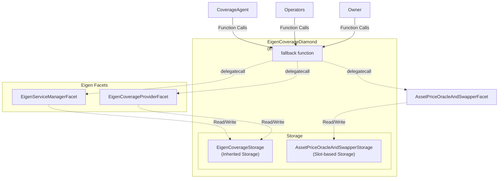

# EigenLayer Coverage Provider Architecture

This document describes the EIP-2535 Diamond Standard architecture used for the EigenLayer coverage provider integration.

## Overview

The EigenLayer coverage manager uses the **EIP-2535 Diamond Standard** — a modular proxy pattern that enables:

- **Dynamic function routing** — Functions are routed via selector lookup in the `fallback()`
- **Upgradeable facets** — Facets can be added, replaced, or removed via `diamondCut()`
- **Shared storage context** — All facets operate on the diamond's storage via `delegatecall`
- **Standard introspection** — Query facets and their functions via `IDiamondLoupe`
- **EIP-165 support** — Interface detection via `supportsInterface()`

---

## Architecture Diagram



---

## How It Works

### 1. Function Routing via `fallback()`

When a function is called on `EigenCoverageDiamond`, the `fallback()` function:

1. Extracts the function selector from `msg.sig`
2. Looks up the facet address from the diamond's selector registry
3. Executes `delegatecall` to the facet
4. Returns the result (or reverts with the facet's error)

```solidity
fallback() external payable {
    LibDiamond.DiamondStorage storage ds = LibDiamond.diamondStorage();
    address facet = ds.selectorToFacetAndPosition[msg.sig].facetAddress;
    if (facet == address(0)) revert FunctionNotFound(msg.sig);
    
    assembly {
        calldatacopy(0, 0, calldatasize())
        let result := delegatecall(gas(), facet, 0, calldatasize(), 0, 0)
        returndatacopy(0, 0, returndatasize())
        switch result
        case 0 { revert(0, returndatasize()) }
        default { return(0, returndatasize()) }
    }
}
```

### 2. Adding/Replacing/Removing Facets via `diamondCut()`

The `IDiamondCut` interface extends `IDiamond` and allows the owner to modify the diamond's facets:

```solidity
// Base interface with types and events
interface IDiamond {
    enum FacetCutAction { Add, Replace, Remove }
    
    struct FacetCut {
        address facetAddress;
        FacetCutAction action;
        bytes4[] functionSelectors;
    }
    
    event DiamondCut(FacetCut[] _diamondCut, address _init, bytes _calldata);
}

// Extended interface with diamondCut function
interface IDiamondCut is IDiamond {
    function diamondCut(
        FacetCut[] calldata _diamondCut,
        address _init,
        bytes calldata _calldata
    ) external;
}
```

### 3. Diamond Storage Pattern

Diamond-specific data (facets, selectors, owner) is stored at a fixed slot to prevent collisions with app storage:

```solidity
bytes32 constant DIAMOND_STORAGE_POSITION = keccak256("diamond.standard.diamond.storage");

struct DiamondStorage {
    mapping(bytes4 => FacetAddressAndPosition) selectorToFacetAndPosition;
    mapping(address => FacetFunctionSelectors) facetFunctionSelectors;
    address[] facetAddresses;
    mapping(bytes4 => bool) supportedInterfaces;
    address contractOwner;
}
```

---

## File Structure

```
src/
├── diamond/                                   # Reusable EIP-2535 infrastructure
│   ├── interfaces/
│   │   ├── IDiamond.sol                       # Base interface (FacetCutAction, FacetCut, DiamondCut event)
│   │   ├── IDiamondCut.sol                    # Extends IDiamond, adds diamondCut() function
│   │   ├── IDiamondLoupe.sol                  # Introspection interface
│   │   └── IERC165.sol                        # Interface detection
│   ├── libraries/
│   │   └── LibDiamond.sol                     # Diamond storage & cut logic
│   ├── facets/
│   │   ├── DiamondCutFacet.sol                # Implements IDiamondCut
│   │   └── DiamondLoupeFacet.sol              # Implements IDiamondLoupe + IERC165
│   └── Diamond.sol                            # Base diamond contract with fallback()
│
├── providers/
│   └── eigenlayer/
│       ├── EigenCoverageDiamond.sol           # Main diamond proxy
│       ├── EigenCoverageStorage.sol           # App-specific storage
│       ├── Types.sol                          # EigenAddresses struct
│       ├── Errors.sol                         # Custom errors
│       ├── interfaces/
│       │   └── IEigenServiceManager.sol       # Service manager interface
│       ├── facets/
│       │   ├── EigenServiceManagerFacet.sol   # IEigenServiceManager implementation
│       │   └── EigenCoverageProviderFacet.sol # ICoverageProvider implementation
│       └── README.md                          # This file
│
├── facets/
│   └── AssetPriceOracleAndSwapperFacet.sol   # Asset price oracle and swapper facet
│
├── interfaces/
│   └── ICoverageProvider.sol                  # Coverage provider interface
│
└── utils/
    └── deployments/                           # Deployment helper libraries
        ├── DiamondFacetsDeployer.sol          # Deploy diamond core facets
        ├── EigenFacetsDeployer.sol            # Deploy Eigen-specific facets
        └── AssetPriceOracleAndSwapperFacetDeployer.sol  # Deploy asset price oracle facet
```

---

## Deployment

The diamond is deployed with all facets registered in the constructor. We use deployment helper libraries for modular, reusable deployment logic:

```solidity
import {DiamondFacetsDeployer} from "../utils/deployments/DiamondFacetsDeployer.sol";
import {EigenFacetsDeployer} from "../utils/deployments/EigenFacetsDeployer.sol";
import {AssetPriceOracleAndSwapperFacetDeployer} from "../utils/deployments/AssetPriceOracleAndSwapperFacetDeployer.sol";

// 1. Deploy facets using helper libraries
(DiamondCutFacet diamondCutFacet, DiamondLoupeFacet diamondLoupeFacet) =
    DiamondFacetsDeployer.deployDiamondFacets();
(EigenServiceManagerFacet serviceManagerFacet, EigenCoverageProviderFacet coverageProviderFacet) =
    EigenFacetsDeployer.deployEigenFacets();
AssetPriceOracleAndSwapperFacet assetPriceOracleFacet =
    AssetPriceOracleAndSwapperFacetDeployer.deployAssetPriceOracleAndSwapperFacet();

// 2. Get facet cuts from helper libraries
IDiamondCut.FacetCut[] memory diamondCuts =
    DiamondFacetsDeployer.getDiamondFacetCuts(diamondCutFacet, diamondLoupeFacet);
IDiamondCut.FacetCut[] memory eigenCuts =
    EigenFacetsDeployer.getEigenFacetCuts(serviceManagerFacet, coverageProviderFacet);
IDiamondCut.FacetCut memory assetPriceOracleCut =
    AssetPriceOracleAndSwapperFacetDeployer.getAssetPriceOracleAndSwapperFacetCut(
        assetPriceOracleFacet
    );

// 3. Combine all facet cuts (5 facets total)
IDiamondCut.FacetCut[] memory cuts = new IDiamondCut.FacetCut[](5);
cuts[0] = diamondCuts[0]; // DiamondCutFacet
cuts[1] = diamondCuts[1]; // DiamondLoupeFacet
cuts[2] = eigenCuts[0]; // EigenServiceManagerFacet
cuts[3] = eigenCuts[1]; // EigenCoverageProviderFacet
cuts[4] = assetPriceOracleCut; // AssetPriceOracleAndSwapperFacet

// 4. Deploy diamond with cuts and initialization args
EigenCoverageDiamond diamond = new EigenCoverageDiamond(cuts, args);
```

### Deployment Helper Libraries

The deployment helper libraries (`utils/deployments/`) provide:

- **`DiamondFacetsDeployer`**: Deploys and configures diamond core facets (DiamondCutFacet, DiamondLoupeFacet)
- **`EigenFacetsDeployer`**: Deploys and configures Eigen-specific facets (EigenServiceManagerFacet, EigenCoverageProviderFacet)
- **`AssetPriceOracleAndSwapperFacetDeployer`**: Deploys and configures the asset price oracle facet

Each library provides:
- `deploy*()` functions to deploy facet instances
- `get*FacetCuts()` functions to generate properly configured facet cuts
- `get*Selectors()` functions to get function selectors for each facet

This modular approach ensures consistency between test deployments and production deployments.

---

## Upgrading Facets

After deployment, the owner can upgrade facets via `diamondCut()`:

```solidity
import {IDiamond} from "src/diamond/interfaces/IDiamond.sol";
import {IDiamondCut} from "src/diamond/interfaces/IDiamondCut.sol";
import {EigenFacetsDeployer} from "utils/deployments/EigenFacetsDeployer.sol";

// Deploy new facet version
EigenServiceManagerFacetV2 newFacet = new EigenServiceManagerFacetV2();

// Get selectors using helper library
bytes4[] memory selectors = EigenFacetsDeployer.getEigenServiceManagerSelectors();

// Replace existing functions
IDiamondCut.FacetCut[] memory cuts = new IDiamondCut.FacetCut[](1);
cuts[0] = IDiamond.FacetCut({
    facetAddress: address(newFacet),
    action: IDiamond.FacetCutAction.Replace,
    functionSelectors: selectors
});

// Execute upgrade
IDiamondCut(diamond).diamondCut(cuts, address(0), "");
```

**Note**: When working with `IDiamondCut` types, use `IDiamond.FacetCut` and `IDiamond.FacetCutAction` for struct literals and enum values, since these types are defined in the base `IDiamond` interface.

---

## Introspection

Query the diamond's structure using `IDiamondLoupe`:

```solidity
IDiamondLoupe loupe = IDiamondLoupe(diamond);

// Get all facets
IDiamondLoupe.Facet[] memory facets = loupe.facets();

// Get functions for a specific facet
bytes4[] memory selectors = loupe.facetFunctionSelectors(facetAddress);

// Get facet for a specific function
address facet = loupe.facetAddress(selector);

// Check interface support
bool supported = IERC165(diamond).supportsInterface(interfaceId);
```

---

## Key Benefits of EIP-2535

| Benefit | Description |
|---------|-------------|
| **Modularity** | Logic is separated into focused facets |
| **Dynamic Upgrades** | Add/replace/remove functions without redeployment |
| **No Size Limit** | Bypass the 24KB contract size limit |
| **Gas Efficiency** | Only deploy changed facets |
| **Standard Introspection** | Query facets via IDiamondLoupe |
| **Shared Storage** | All facets operate on consistent storage |
| **Reusable Deployment** | Helper libraries enable consistent deployments across environments |

## Interface Structure

The diamond interfaces follow the EIP-2535 specification:

- **`IDiamond`**: Base interface containing `FacetCutAction` enum, `FacetCut` struct, and `DiamondCut` event
- **`IDiamondCut`**: Extends `IDiamond`, adds the `diamondCut()` function for modifying facets
- **`IDiamondLoupe`**: Provides introspection functions (`facets()`, `facetAddresses()`, `facetAddress()`, `facetFunctionSelectors()`)
- **`IERC165`**: Standard interface detection via `supportsInterface()`

When using these interfaces:
- Function parameters can use `IDiamondCut.FacetCut[]` (since `IDiamondCut` extends `IDiamond`)
- Struct literals and enum values should use `IDiamond.FacetCut` and `IDiamond.FacetCutAction` directly

---

## Storage Considerations

1. **Diamond Storage**: Uses a fixed slot (`keccak256("diamond.standard.diamond.storage")`) for facet registry, managed by `LibDiamond`
2. **EigenCoverageStorage**: Uses inherited storage pattern (regular storage slots) for Eigen-specific data like positions, claims, and operators
3. **AssetPriceOracleAndSwapperStorage**: Uses slot-based storage pattern (`keccak256("asset.price.oracle.and.swapper.storage")`) via `LibAssetPriceOracleAndSwapperStorage`, similar to Diamond Storage
4. **No Collisions**: The fixed slot approach prevents storage slot collisions between:
   - Diamond Storage (facet registry)
   - AssetPriceOracleAndSwapperStorage (asset pairs, slippage)
   - EigenCoverageStorage (inherited storage slots)
5. **Upgradeable**: EigenCoverageStorage includes a `__gap` for future extensions
6. **Shared Context**: All facets operate on the same storage context via `delegatecall`, enabling seamless data sharing across all three storage types

---

## Related Standards

- [EIP-2535: Diamonds, Multi-Facet Proxy](https://eips.ethereum.org/EIPS/eip-2535)
- [EIP-165: Standard Interface Detection](https://eips.ethereum.org/EIPS/eip-165)
- [Diamond Reference Implementation](https://github.com/mudgen/diamond-3)
