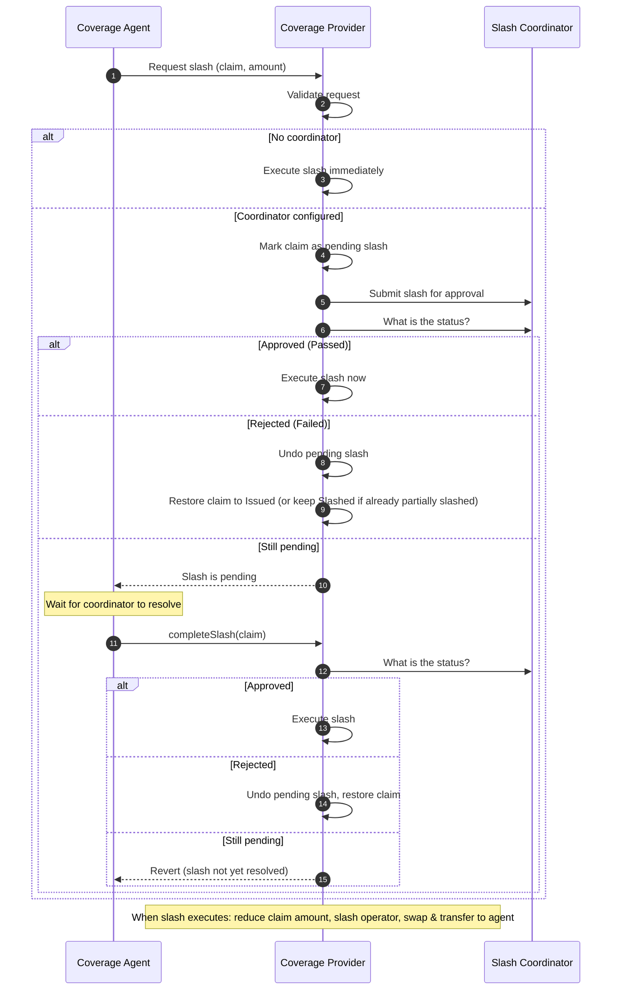
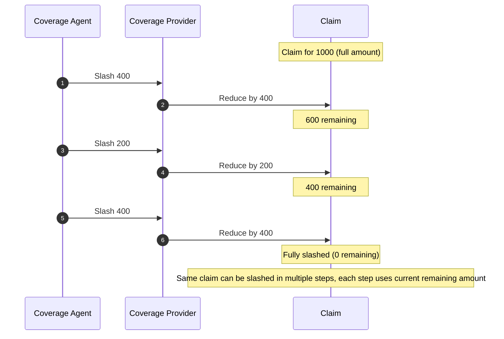

# Eigen Coverage Provider Slashing Workflow

This document describes how slashing works in the Eigen coverage provider, including:

- direct slashes (no coordinator),
- coordinated slashes (`Pending` -> `Passed` -> `completeSlash`, or `Failed` -> revert pending),
- the **pending slash fail case** (coordinator returns `Failed`; pending amount reverted, claim status reverted to `Issued` or left `Slashed`),
- partial slashes, and
- multiple slashes on the same claim.

## Key State + Accounting Rules

- A claim can be slashed while in `Issued`, `PendingSlash`, or `Slashed`.
- `claimSlashAmounts[claimId]` is cumulative and increases on every `slashClaims` call.
- `slashClaims` validates `amount <= claim.amount` for each request at execution time.
- `_initiateSlash` sets `claim.status = Slashed` every time, enabling additional partial slashes.
- A claim amount is reduced by each slash through `_modifyCoverageForAgent(..., -int256(amount))`.
- With a coordinator configured:
  - `slashClaims` sets status to `PendingSlash`, sets `pendingClaimSlashAmounts[claimId]` to the requested amount (replacing any previous pending amount for that claim), and calls `ISlashCoordinator.initiateSlash(...)`.
  - If coordinator returns `Passed`, slashing executes immediately in the same transaction using the pending amount.
  - If coordinator returns `Failed` (either immediately or when `completeSlash` is called), the pending amount is reverted: `claimSlashAmounts[claimId] -= pendingClaimSlashAmounts[claimId]`, `pendingClaimSlashAmounts[claimId] = 0`, and claim status becomes `Issued` if there was no prior slash, or remains `Slashed` if the claim was already partially slashed.
  - Otherwise (coordinator still `Pending`), the claim remains `PendingSlash` until `completeSlash` is called and coordinator `status(...)` is either `Passed` or `Failed`.

## Slashing Coordinator Flow

### Coordinator behavior notes

- `slashClaims` can return `PendingSlash` even if claim status becomes `Slashed` in the same tx (when coordinator immediately returns `Passed`).
- `completeSlash` only succeeds while claim status is `PendingSlash`; after slash execution the claim is `Slashed`, so repeated `completeSlash` calls revert with `InvalidClaim`.
- If coordinator `status(...)` is still `Pending` when `completeSlash` is called, the call reverts with `SlashFailed(claimId)`.

### Pending slash fail case (coordinator returns Failed)

When the coordinator resolves to **Failed** (either in the same tx as `slashClaims` or when `completeSlash` is called):

1. **Revert pending accounting:**  
   `claimSlashAmounts[claimId] -= pendingClaimSlashAmounts[claimId]`, then `pendingClaimSlashAmounts[claimId] = 0`.

2. **Claim status:**
   - If `claimSlashAmounts[claimId] > 0` after the subtraction (i.e. the claim was previously partially slashed), leave `claim.status = Slashed`.
   - Otherwise set `claim.status = Issued` (no executed slash remains; the failed request is fully reverted).

3. **Coverage amount:**  
   `claim.amount` is unchanged, because it is only reduced inside `_initiateSlash`, which is not run when the coordinator fails.

So a **fresh** claim (no prior slash) that goes PendingSlash and then Failed ends up back in `Issued` with the same `claim.amount` and `claimSlashAmounts[claimId] = 0`. A **partially slashed** claim that gets an additional pending slash which then fails stays `Slashed` with `claim.amount` unchanged and `claimSlashAmounts[claimId]` equal to the previously executed slash amount only.

## Partial Slashes and Multiple Slashes on the Same Claim

### Why multiple slashes work

- The function accepts claims already in `Slashed`.
- The slash amount guard uses current `claim.amount`, so each new slash must fit the remaining amount.
- Total slashed accounting is independent (`claimSlashAmounts`) and accumulates across all slash operations.

## After Slashing: Repayment Path

- `repaySlashedClaim(claimId, amount)` is allowed when claim status is `Slashed` or `Repaid`.
- Partial repayments decrement `claimSlashAmounts[claimId]`.
- If repayment covers the full remaining slash amount, claim transitions to `Repaid` and `claimSlashAmounts[claimId]` becomes `0`.
- Additional repayments are still accepted in `Repaid` status and emit `ClaimRepayment`.

## Practical Checklist

- Confirm caller is the claim's `coverageAgent`.
- Confirm claim is not expired for slash initiation.
- For coordinator mode, distinguish:
  - immediate pass (single tx slash), vs
  - pending coordination (requires `completeSlash` later).
- Track both:
  - current claim principal (`claim.amount`), and
  - cumulative slash accounting (`claimSlashAmounts`).
